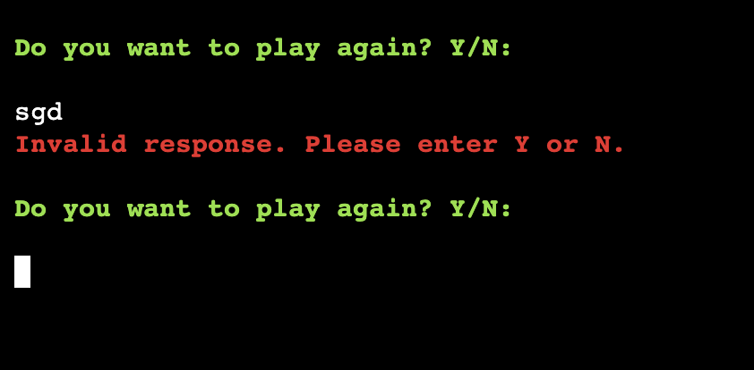

# The Maddest Madlibs Game

#### By Lauren Pechey
[Click here to view the live web application](https://mp3-madlibs-game.herokuapp.com/)

#### HELLO AND WELCOME!

Here you can find the documentation for my command-line Python terminal game: The Maddest Mad Libs Game! Mad Libs is known as one of the world’s funniest word games, and can turn anyone into a comedian without even trying! Originally invented by by Leonard Stern and Roger Price in 1953, [Mad Libs](https://www.madlibs.com/) are simple stories with words removed and replaced by blank spaces. 

This project has been built using only Python, as an educational Project offered as part of Code Institute’s Diploma in Full Stack Software Development. The original game was designed in hardcopy books, so this version allows the player to play through an online platform. Please use the table of contents below to navigate through all of the planning, features, deployment, testing and more!

## Table of Contents

1. [Project Development and Planning](#project-development-and-planning)
    - [Project Goals](#project-goals)
        - [Project Purpose](#project-purpose)
        - [Client Goals](#client-goals)
        - [Target Audience](#target-audience)
        - [User Goals](#user-goals)
    - [Research](#research)
        - [Market Review](#market-review)
        - [Key Takeaways](#key-takeaways-from-market-review)
    - [User Stories](#user-stories)
    - [Content](#content)
    - [Design, Layout and Structure](#design-layout-and-structure)
        - [Flowchart](#wireframes)
        - [Structure and Layout](#structure-and-layout)
        - [Design and Colour](#design-and-colour)
2. [Technologies Used](#technologies-used)
    - [Languages](#languages)
    - [Tools](#tools)
3. [Features](#features)
    - [Whole Site](#whole-site)
        - [Favicon](#favicon)
        - [Footer](#footer)
    - [Welcome Section](#welcome-section)
        - [How to play](#list-of-instructions)
    - [Game Section](#game-section)
     - [Game Section](#game-section)
        - [Choose a Title](#choose-a-title)
        - [User Input Prompts](#user-input-prompts)
     - [Results Section](#results-section)
        - [Story Reveal](#story-reveal)
        - [Restart Game](#restart-game)
    - [Other Pages](#other-pages)
        - [404 page](#404-page)
    - [Future Features](#future-features)
4. [Testing](#testing)
    - [Manual Testing](#manual-testing)
        - [Responsiveness / Device Testing](#responsiveness-/-device-testing)
        - [Browser Compatibility](#browser-compatibility)
        - [Solved Bugs](#solved-bugs)
        - [Testing User Stories](#testing-user-stories)
    - [Automated Testing](#automated-testing)
        - [PEP8 Validator Testing](#pep8-validator-testing)
        - [Accessibility](#accessibility)
        - [Performance](#performance)
5. [Deployment](#deployment)
6. [Credits](#credits)

## Project Development and Planning 

### Project Goals 

#### Project Purpose

This back-end python project was planned and developed using principles of User Experience (UX) design, which include the five planes of Strategy, Scope, Structure, Skeleton, and Surface. Using these principles, the aim was to create a fun, easy-to-use and entertaining version of Mad Libs on an online platform! 

#### Client Goals

The Maddest Mad Libs game was built as a milestone project for my Diploma in Fullstack Software Development with [Code Institute](https://codeinstitute.net/global/full-stack-software-development-diploma/). It is an interactive word game designed to entertain users of all ages and backgrounds who want to be entertained while with friends or at a party. Despite this being built for educational reasons, it was still treated as a real-world application for potential clients interested in learning about their personalities in a fun, engaging way. Thus, this client's goals would be:

- Engaging the players by allowing them to enter prompts of their choice
- Entertaining players by generating random stories with their unique inputs
- Ensuring that the instructions and prompts are clear, and the game is simple to navigate

#### Target Audience

- This game is designed for players of any background or age, but will most likely be used for entertainment purposes, such as during social events and gatherings
- It is also likely to draw in players who enjoy playing word games or creating stories
- The simplicity of the website makes it easy for adults, teenagers and even children to play, and replay, the game as many times as they want, and access different results each time

#### Player Goals 

This game aims to ensure that players can:

- Be given access to clear instructions on how to play the game 
- Choose a story title they are interested in
- Follow the input prompts easily with no delays or interruptions
- Play an interactive, functional, fun game
- Be entertained with a fun or silly story result after answering all of the questions
- Replay the game as many times as they want to, to explore different results

#### Market Review 

Before designing the game, I reviewed other Mad Libs games, as well as researched on the original version of the game to see how it could be implemented as an online game (see below). I did this in order to get a feel of how they presented themselves, as well as which content and features they offered. I also reviewed what appeared to work well for the player and what needed improvements (see Key Takeaways). 

[Python Mad Libs Generator](https://data-flair.training/blogs/python-mad-libs-generator-game/) | [Beanz](https://kidscodecs.com/python-mad-libs/) | [Simple Mad Libs](https://www.codespeedy.com/simple-mad-libs-generator-game-in-python/) | [Teach with ICT](https://www.teachwithict.com/mad_libs.html) | [The Word Finder](https://www.thewordfinder.com/wordlibs/)

#### Key Takeaways

- The game should be clean, simple, and easy to navigate
- The game should not have any delays or interruptions after the user enters a prompt
- The instructions should be simple and easy to understand
- There should be a maximum of 20 prompts, to keep the player engaged and interested

### User Stories

In a real-world application, this kind of game will mostly likely be used by a visitor as many times as they want to be entertained, and  would likely form part of a larger website e.g. a website with a selection of other online games for players to choose from. Therefore, all user stories relate to a first-time user. As a first-time player, I would like to:

- take part in a fun, interesting game
- find out what the game is about and what to expect before starting
- be able to choose which type of story I want to create a Mad Lib about
- navigate easily through the game prompts  
- have the option of replaying the game if I don't like the result
- access the game on any device

These user stories gave me a clear scope for the website and enabled me to stay on track with the project, preventing issues like scope creep at a later stage after the coding process. 

## How to Play

1. The player is first introduced to the game and how it works.
2. The player will then be given a list of story titles to choose from, by entering the number of the story title. 
3. After they have selected their story title, the player must enter "Y" to play. 
4. The player will be given 20 prompts, one at a time, which will ask them to enter a particular part of speech, e.g. "Enter a noun: ".
    - Note: If the player enters an invalid input, such as a number, they will be given an error message and asked to re-enter their word of choice.
    - Note 2: If the player enters an invalid part of speech, e.g. a noun instead of an adjective, they will also receive an error message and will be required to enter the correct part of speech.
5. After the player answers all 20 prompts correctly, the story result with their inputs will be displayed to them and they will hopefully be entertained by their answers.
6. The player has the option to replay the game as many times as they want, and can choose a different story title each time. 

## Features 

### Existing Features

#### Welcome Section

- This page welcomes the user and introduces them to the game of Mad Libs.
- It then asks the user if they would like to learn how to play the game.
- If the user enters "Y", they are taken to the [instructions section](#instructions-section).
- If the user enters "N", they skip the instructions section and are taken to the [story title section](#story_title_section). 
- If the user does not enter "Y" or "N", they are given an error message (see screenshot below). 
- The text is displayed with a typewriter effect, for visual aesthetics. 

Screenshots

_Welcome Page_

_Error Message_

#### Instructions Section

- The user is shown instructions on how to play the game. 
- They are then asked "Ready to Play?"
    - If the user answers "Y", they will be taken to the [input section](#input-section).
    - If the user answers "N", the game will end (see screenshots).
    - - If the user does not enter "Y" or "N", they are given an error message (see screenshot below). 
- The text is displayed with a typewriter effect, for visual aesthetics. 

Screenshots

_Instructions Page_

_Error Message_

_When user enters "N"_

#### Input Section

- Here, the user will be given 20 prompts, with a mix of adjectives, nouns, verbs etc.
- If the user enters the correct input, they will be taken to the next prompt.
- The terminal is cleared everytime 5 inputs have been entered, to prevent too much text displaying at once.
- If the user enters invalid input, e.g. a digit or blank space, they will be given an error message to re-enter.
- Alternatively, if they enter a word less than 2 characters or more than 20 characters, they will also be shown an error message (see screenshots below).

Screenshots

_Input Section__

_Invalid Inputs_

#### Story Section

- After the user has entered all 20 prompts correctly, their story will be revealed with all of their inputs. 
- They will then be asked "Do you want to play again?"
    - If the user answers "Y" they will be taken back to the welcome section.
    - If the user answers "N" they will be given another question "Would you like to be taken back to the main menu?"
        - If "Y", they will be taken back to the welcome section.
        - If "N", they will be given a message that explains how they can restart the game with the "Run Terminal" button, should they change their minds.
    - If the user answers neither "Y" nor "N", they will be given an error message (see screenshots).

Screenshots

_Story Section__

_Replay option_

_Return to main page message_

_End message if user answers "N"_

_Error message for invalid input_

#### Future Features

1. Multiplayer Option

As a future feature, I would love to create code that enables more than 1 player to play the game at the same time. For example, 2 plays entering inputs interchangeably for the same story. 

2. Grammar Validation

I would like to add validation that checks if the user enters the correct part of speech, e.g. If the user enters a 'noun' instead of an 'adjective', the game should register this and display an error message. Unfortunately, this fell out of the scope of this project. 

## Technologies Used 

This website used Python as the main language, alongside some already built-in languages from the Code Institute Template. A list of those included in the project can be seen as follows: 

### Languages 
- [HTML5](https://en.wikipedia.org/wiki/HTML5)
- [CSS3](https://en.wikipedia.org/wiki/Cascading_Style_Sheets)
- [JavaScript](https://en.wikipedia.org/wiki/JavaScript)
- [Python](https://en.wikipedia.org/wiki/Python_(programming_language))

### Tools 
- [Lucid Flowchart](https://www.lucidchart.com/pages/)
     - Lucid Flowchart was used to map the logic of the Mad Libs game during the initial design process.
- [Git](https://git-scm.com/)
    - Git was used for version control via GitPod, by using the terminal to Git and Push to GitHub.
- [GitHub](https://github.com/)
    - GitHub was used to store the project code after being created in GitPod/Git.
- [Gitpod](https://www.gitpod.io/)
    - Gitpod was used to create, edit and preview the project's code.
- [Heroku](https://dashboard.heroku.com/login)
    - Heroku was used to deploy the Project.
- [Favicon.io](https://favicon.io/favicon-converter/)
    - Used to create and add the favicon to the browser tab.

## Testing

### Manual Testing

#### Testing User Stories

- be able to choose which type of story I want to create a Mad Lib about
- navigate easily through the game prompts  
- have the option of replaying the game if I don't like the result
- access the game on any device

I ran manual tests on the website, based on the user stories mentioned above:

| No. | User Goal | How is it achieved? |
| :--- | :--- | :--- |
| 1 | I want to take part in a fun, interesting game | This game is a fun, interactive game with the aim of entertaining users and making them laugh. |
| 2 | I want to find out what the game is about and what to expect before starting | The welcome section contains information about what the game is about, and the instructions explain how the game works. |
| 3 | I want to be able to choose which type of story I want to create a Mad Lib about | The user can choose from a list of story titles before starting the game. |
| 4 | I want to navigate easily through the game prompts | The user is taken to the next prompt as soon as they enter the correct prompt. |
| 5 | I want to have the option of replaying the game if I don't like the result | The user is asked if they would like to replay the game after they have finished a round. |
| 6 | I want to access the game on any device | The game is functional on all devices, although due to the nature of python, it is better suited to desktops. |

#### Browser Compatibility

The site was tested on the following browsers, with no browser-specific bugs detected. 

- Google Chrome
- Mozilla Firefox
- Apple Safari

#### Responsiveness/Device Testing

The website was tested on the following devices:
- HP Display 27-inch External Monitor
- Apple Macbook Pro 13-inch
- Galaxy S9+
- Apple iPhone 12 Pro
- Apple iPhone SE
- Apple iPad mini
- Apple iPad
- Galaxy Tablet
- Google Chrome Developer Tools - using responsive testing for all screen sizes

The website functioned as expected on all devices. However, it is recommended that the game is played on desktop screens. Due to the nature of backend applications in general, the game plays better on non-touch screens. 

### Solved Bugs

#### All results were displayed at once

When the user retakes the quiz, all of the results were displaying at the same time, rather than just one. This was an issue with the displaying results function in the JavaScript code: The "hide" class was not being re-added to the unwanted results in the function. Once this was added, the results functioned as expected:

Screenshots

_Results bug_

_Results fixed_

#### Retake Quiz button not working

When the user clicked the retake quiz button, the user was taken to question 10 of 10, instead of question 1 of 10. This is because the score and progress bar were not reset to 0, so the questions were not reset to the beginning. To fix this, I reset the score and progress bar to 0 and the quiz worked as expected again.

Screenshots

_Quiz page shown after user clicked the retake quiz button_

_Quiz page shown after bug was fixed_

### Bugs

## Deployment

### Heroku

The project was deployed using Code Institute's mock terminal for Heroku. The steps to deploy are as follows: 
1. Fork or clone this repository (see steps on how to do this [here](#forking-the-github-repository))
2. Navigate to your Heroku Dashboard and select "Create new app".

Screenshots

3. Input a meaningful name for your app and choose the region best suited to your location.

Screenshots

4. Select "Settings" from the tabs and click "Reveal Config Vars".
    - Input PORT and 8000 as one config var and click add. 
    - Input CREDS and the content of your Google Sheet API creds file as another config var and click add.

Screenshots

_Settings Tab_

_Config Vars_

_Input CREDS_

5. Click "Add buildpack".
    - Add "nodejs" and "python" from the list or search if necessary, remember to click save.
    - Note: Python must be the first buildpack.

Screenshots

_Adding a buildpack_

_Putting the buildpacks in the correct order_

6. Select "Deploy" from the tabs.

Screenshots

7. Select "GitHub - Connect to GitHub" from deployment methods, then click "Connect to GitHub" in the created section.

Screenshots

8. Search for your GitHub repository by name and select it.

Screenshots

9. Either click Enable Automatic Deploys for automatic deploys or Deploy Branch to deploy manually. 
    - Note: Manually deployed branches will need re-deploying each time the repo is updated.

Screenshots

10. Click View to view the deployed site. Note: It may take a moment to become available.

Screenshots

### Forking the GitHub Repository

You can fork the repository by following these steps:
1. Go to the GitHub repository.
1. Click on Fork button in upper right hand corner.

### Cloning the GitHub Repository

You can clone the repository to use locally by following these steps:
1. Navigate to the GitHub Repository you want to clone.
2. Click on the code drop down button.
3. Click on HTTPS.
4. Copy the repository link to the clipboard.
5. Open your IDE of choice (git must be installed for the next steps).
6. Type git clone copied-git-url into the IDE terminal.

The project will now be cloned locally for you to use.

## Credits

### Code

- [StackOverFlow](https://stackoverflow.com/questions/8924173/how-can-i-print-bold-text-in-python) for the built-in colour codes.
- [Rhino](https://developer.rhino3d.com/guides/rhinopython/python-statements/#:~:text=You%20cannot%20split%20a%20statement%20into%20multiple%20lines%20in%20Python,continued%20on%20the%20next%20line.) helped with Python syntax errors.
- [Tech Beamers](https://www.techbeamers.com/python-multiline-string/) assisted in forming multiline F strings.

### Acknowledgements

- My mentor, Rohit Sharma, for all of his help and advice throughout the project.
- The whole team at [Code Institute](https://codeinstitute.net/) for their teaching and support.